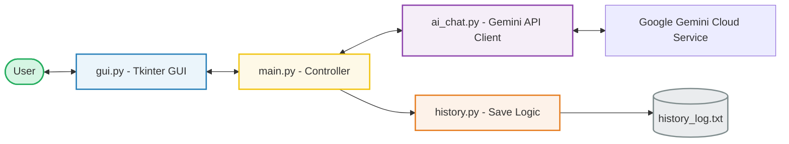
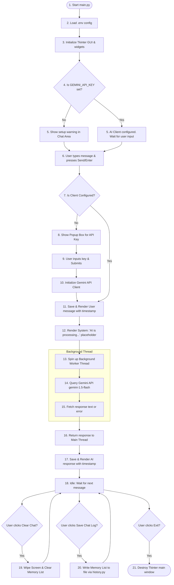

# Modular AI Chatbot using Python and Gemini API

This project is a clean, modular, and beginner-friendly AI Chatbot application designed for a college engineering Python assignment. It uses **Tkinter** for the Graphical User Interface (GUI) and the **Google Gemini API** for intelligence, structured specifically to demonstrate software engineering separation of concerns.

---

## 🏗️ Project Architecture & Data Flow

The project is split into four distinct modules to allow team collaboration and clean division of labor.

### 🔌 System Architecture
The diagram below illustrates how data and control flow through the system:



### 🔁 Application Lifecycle (Flowchart)
Here is the functional logical path from starting the application to handling a chat query:



---

## 📁 File Descriptions 

| File | Module Name | Primary Responsibility |
| :--- | :--- | :--- | :--- |
| **`main.py`** | **Controller** | Entry point; handles app orchestration, thread safety, and triggers callbacks. | 
| **`gui.py`** | **View** | Tkinter widgets construction, color palettes, event bindings, and text renders. | 
| **`ai_chat.py`** | **Model (AI)** | Directly queries the Gemini REST API using Python's standard `urllib.request`. | 
| **`history.py`** | **Model (File I/O)**| Text formatting, generating timestamp-based filenames, and file writing. | 
---

## 🚀 Installation & Usage Guide

### Prerequisites
Make sure you have **Python 3.8+** installed on your system. This codebase is fully compatible with pre-release versions such as Python 3.14. You can verify your version by running:
```bash
python --version
```

### Step 1: Set Up your API Key
1. Obtain a free Gemini API Key from Google AI Studio.
2. Duplicate the `.env.template` file and rename it to `.env`:
   ```bash
   copy .env.template .env
   ```
3. Open `.env` in a text editor and replace `your_gemini_api_key_here` with your actual key:
   ```env
   GEMINI_API_KEY=AIzaSyD_ExampleKey123...
   ```
*(Note: If you do not create a `.env` file, the application will automatically pop up a dialog asking for your API Key when you send your first message).*

### Step 2: Run the Application
Since this project uses **only** the Python Standard Library, there are **no external dependencies to install**! You do not need to run `pip install`. Simply start the application by running:
```bash
python main.py
```

---

## 💡 Key Coding Concepts Used (For Viva / Presentation)
- **Zero-Dependency REST API Connection**: Explains how client-server web apps query cloud APIs directly using Python's built-in `urllib.request` and `json` libraries.
- **Object-Oriented Programming (OOP)**: Using classes (`ChatbotGUI`, `GeminiChatClient`, `ChatbotController`) to represent system blocks.
- **Multithreading (`threading` module)**: Moving the API call off the main thread. This prevents the Tkinter application from freezing or showing a "Not Responding" status during network latency.
- **Callback Pattern**: The GUI triggers callback hooks passed to it by `main.py`, showing proper decoupling.
- **File I/O (Context Managers)**: Using `with open(...)` to safely write text files with automatic handle closures.

